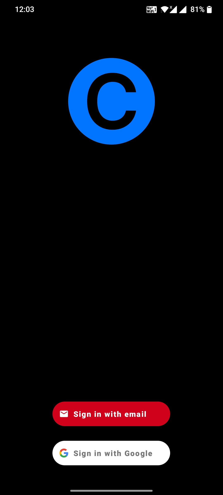
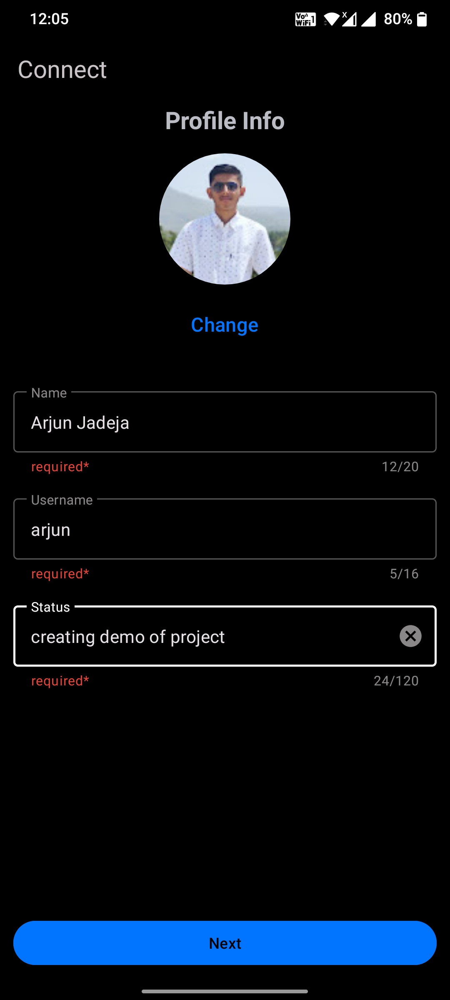
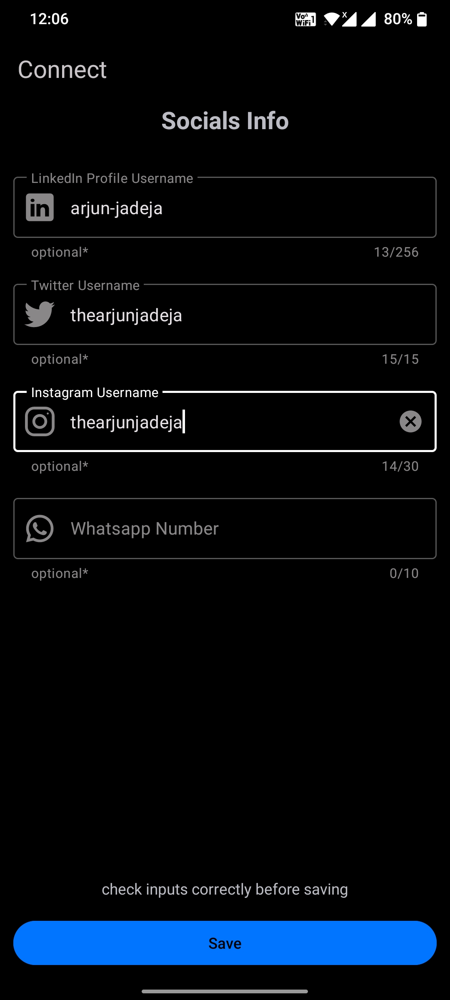
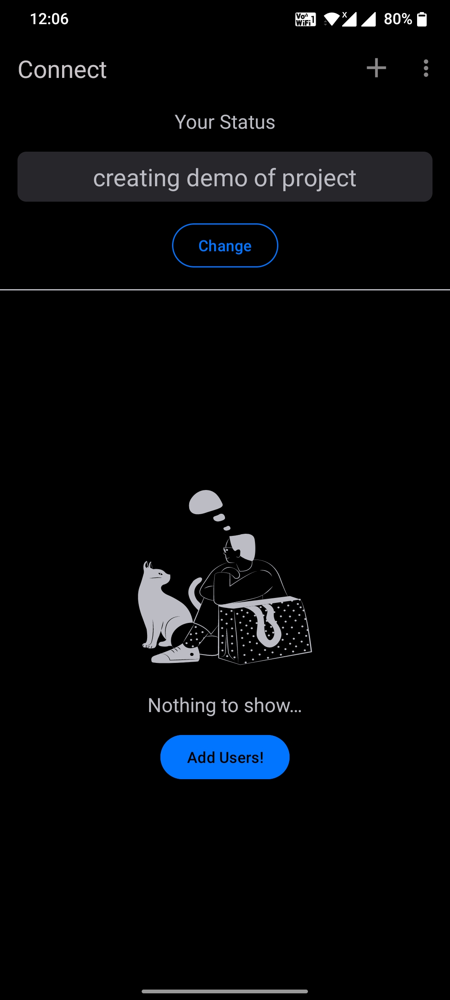
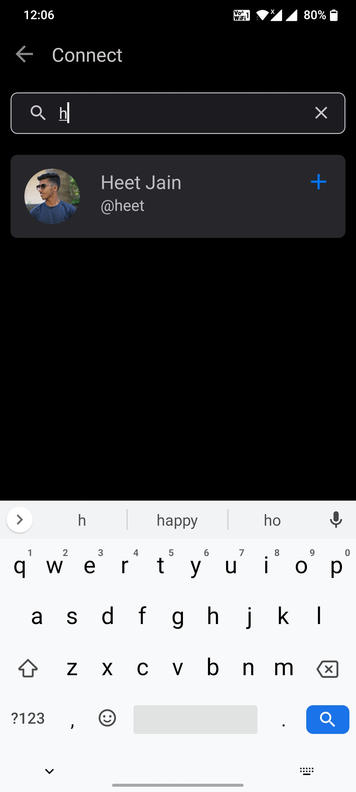
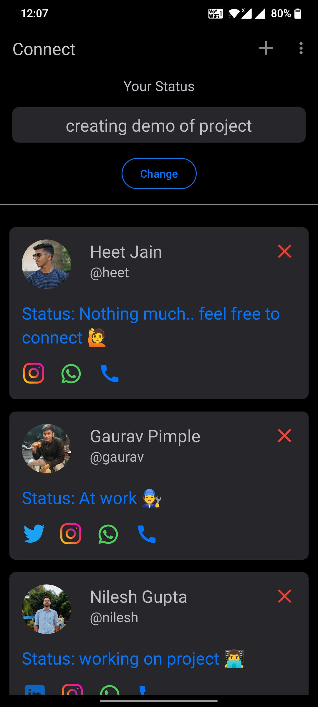
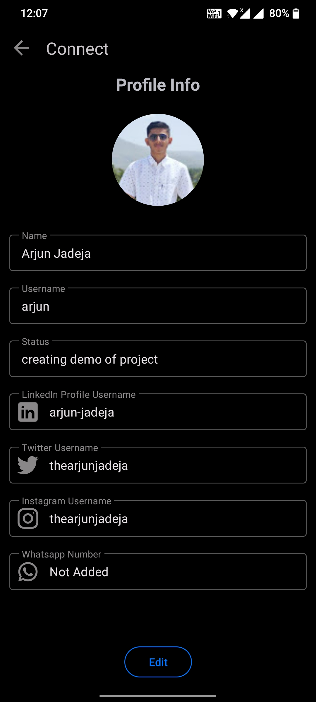
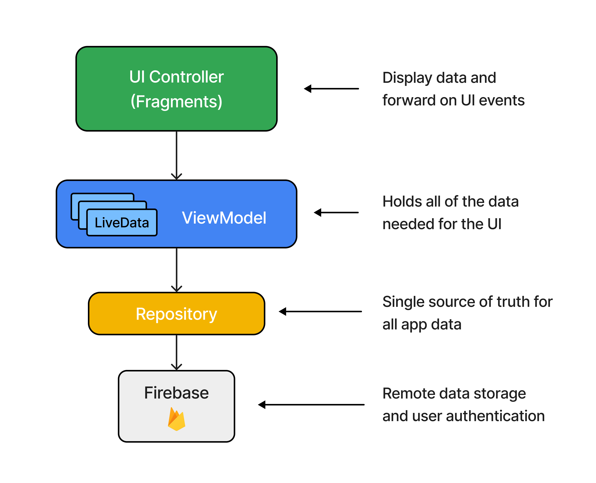

<h1 align="center">Connect</h1>

<p align="center">  
🔗Connect is an android app which helps you to connect with people according to their realtime state.
</p>

## Preview

<p float="left">
   
  
  
   
   
  
  
</p>

## Demo
Watch [App Demo](https://www.youtube.com/watch?v=Faj8BKEis_I) on YouTube.

## Download
Go to the [Releases](https://github.com/ArjunJadeja/Connect/releases) to download the latest APK.

## Tech stack & Open-source libraries
- Minimum SDK level 21
- [Kotlin](https://kotlinlang.org/) - Modern, concise and safe programming language.
- [Flow](https://developer.android.com/kotlin/flow) - A flow is a stream of data that can be computed asynchronously.
- [Coroutines](https://github.com/Kotlin/kotlinx.coroutines) - A concurrency design pattern to execute code asynchronously.
- Jetpack
  - Lifecycle - Observe Android lifecycles and handle UI states upon the lifecycle changes.
  - Navigation - Implements navigation from simple button clicks to more complex patterns.
  - ViewModel - Manages UI-related data holder and lifecycle aware. Allows data to survive configuration changes such as screen rotations.
  - LiveData - LiveData is lifecycle-aware, meaning it respects the lifecycle of other app components, such as activities, fragments, or services.
  - ViewBinding - Binds UI components in your layouts to data sources in your app using a declarative format rather than programmatically.
- Architecture
  - MVVM Architecture (View - ViewModel - Network)
- [Firebase](https://github.com/firebase/quickstart-android) - Application development platform that helps you build, improve, and grow your app.
- [Glide](https://github.com/bumptech/glide) - An image loading and caching library for Android.
- [Material-Components](https://github.com/material-components/material-components-android) - Material design components for building View layouts and Animations.

## Architecture
**Connect** is based on the MVVM architecture and the Repository pattern.
<p float="left">
   
</p>

## MAD Score


## Credits
[Add Users Illustration](https://iconscout.com/illustration/boy-waiting-with-cat-2637397) by [IconScout Store](https://iconscout.com/contributors/iconscout).

[Search Users Illustration](https://iconscout.com/illustration/searching-2637403) by [IconScout Store](https://iconscout.com/contributors/iconscout).

# License
```xml
Designed and developed by 2022 Arjun Jadeja

Licensed under the Apache License, Version 2.0 (the "License");
you may not use this file except in compliance with the License.
You may obtain a copy of the License at

   http://www.apache.org/licenses/LICENSE-2.0

Unless required by applicable law or agreed to in writing, software
distributed under the License is distributed on an "AS IS" BASIS,
WITHOUT WARRANTIES OR CONDITIONS OF ANY KIND, either express or implied.
See the License for the specific language governing permissions and
limitations under the License.
```
